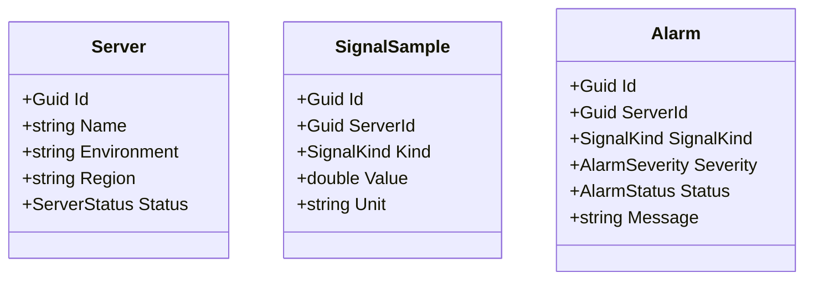

# Server Signal Monitor

.NET 8 REST API, containerisiert mit Docker

Vorstellung, Architekturentscheidungen und Live-Demo

---

# Aufgabe (minimal requirements)

- Web-Service mit C# / .NET 8
- Endpunkte zum Anzeigen, Anlegen und Löschen eines Eintrags
- Einfache Datenhaltung (In-Memory oder SQLite)
- mit Docker build- und startbar
- Dokumentation und README

---

# Vorgehen

| Iteration | Fokus | Ergebnis |
| --- | --- | --- |
| **1** | Prototyp | Minimalanforderungen, Codex-Build, erste API-Calls |
| **2** | Deployment Tracker | Swagger/Doku, README, Tests, Feedback |
| **3** | Server Signal Monitor | Domain Model, Validierung, Demo-API, nächste Schritte |

---

# Idee

Ein Server Signal Monitor für einfache Betriebsdaten.

- Server registrieren
- Heartbeat, CPU und Memory als Signals erfassen
- Alarme bei einfachen Schwellwerten anzeigen

---

# API

| Methode | Pfad | Zweck |
| --- | --- | --- |
| `GET` | `/api/servers` | Server anzeigen und filtern |
| `GET` | `/api/servers/{id}` | Einzelnen Server anzeigen |
| `POST` | `/api/servers` | Server registrieren |
| `POST` | `/api/servers/{id}/signals` | Signal erfassen |
| `GET` | `/api/signals` | Signals anzeigen |
| `GET` | `/api/alarms` | Alarme anzeigen |
| `PUT` | `/api/alarms/{id}/status` | Alarmstatus aktualisieren |
| `DELETE` | `/api/servers/{id}` | Server löschen |
| `GET` | `/health` | Health Check |

<!--
-->

---

# Wichtige Entscheidungen

- .NET 8: LTS
- In-Memory über Interface
- JSON Enums als Strings
- Dokumentation über Swagger/OpenAPI
- Validierung: z.B. über `400 Bad Request`
- Tests: xUnit und API-Integrationstests

<!--
Interface: später austauschbar gegen SQLite/DB
String-Enums: lesbarer in Swagger und Requests
Validierung: null, fehlende Felder, falsche Typen, ungültige Enums
Tests: Verhalten prüfen, nicht jedes Implementierungsdetail
-->

---

# Demo Time!

- API (Swagger)
- Health Check
- Code-Walkthrough
- Tests

---

# Nächste Schritte

- Persistenz: SQLite, Migrationen, Concurrency
- API-Reife: Auth, Rollen, Pagination, ProblemDetails
- Skalierung & Schutz: Indexes, Rate Limits, Request Limits
- Betrieb: Logging, Metriken, Tracing, CI/CD
- Alerting: konfigurierbare Schwellwerte und Benachrichtigungen

<!--
Migrationen: versionierte Änderungen am Datenbankschema
Concurrency: Handling von gleichzeitigen Datenbank-Änderungen
Indexes: Inhaltsverzeichnis für Datenbanken
Rate Limits: Request-Begrenzung
Request Limits: Request-Größen-Begrenzung
Metriken: Antwortzeiten, Fehlerraten, Anzahl Requests, CPU-Auslastung
Tracing: Request durch mehrere Schritte/Services verfolgen
CI/CD: Continuous Delivery (make deployable) / Continuous Deployment (deploy automatically)
-->
